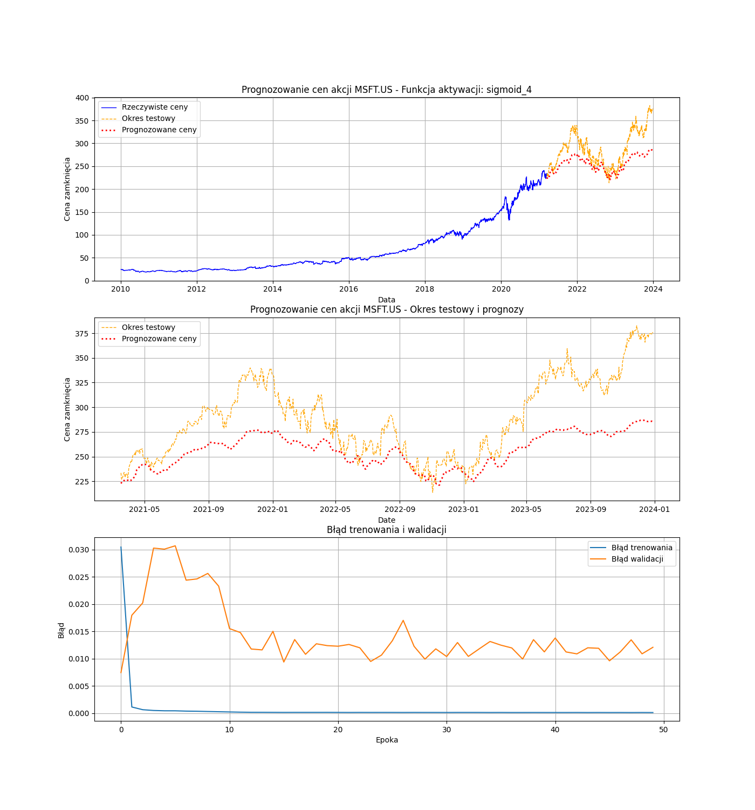
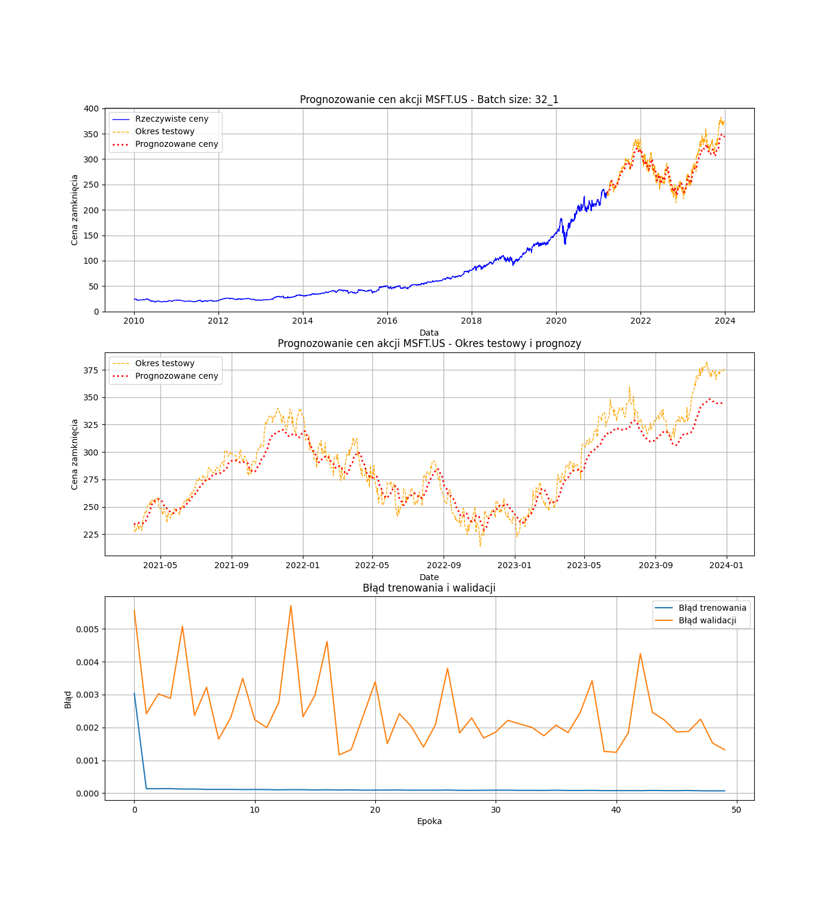
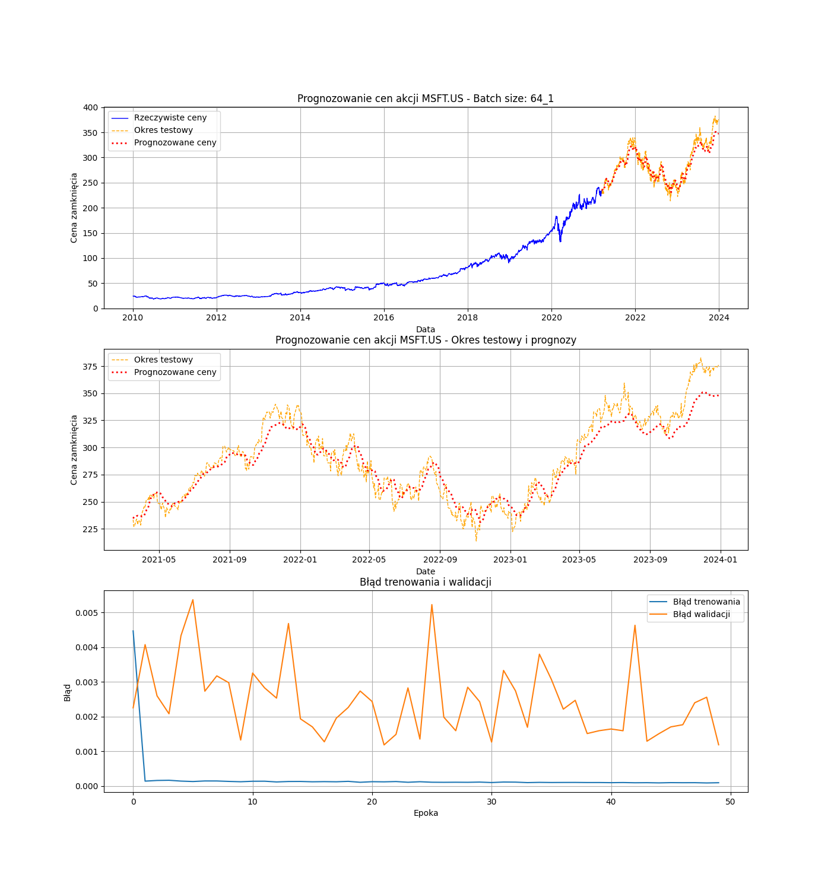
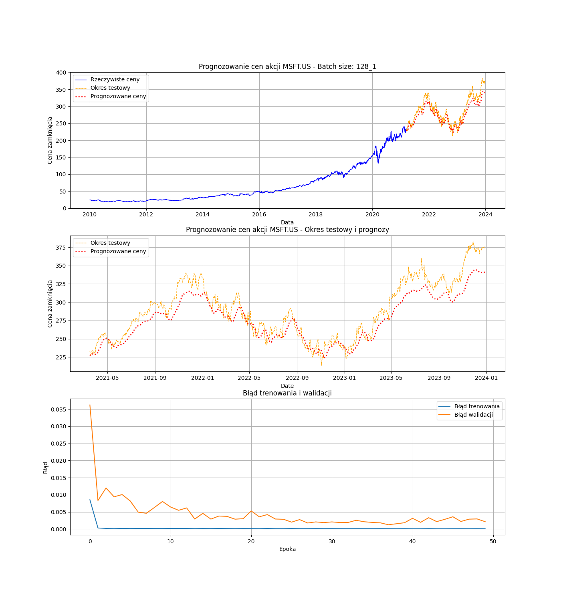
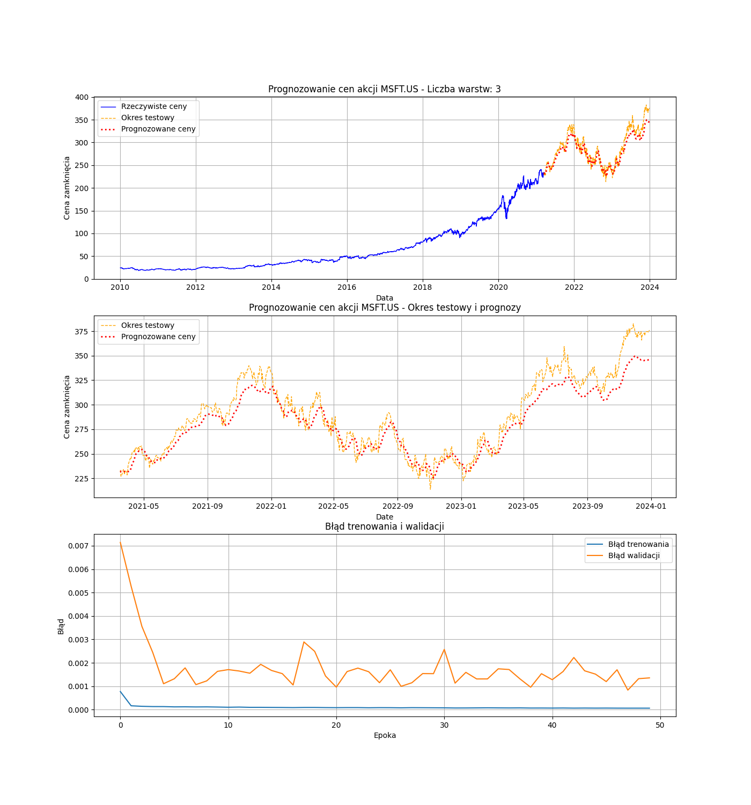
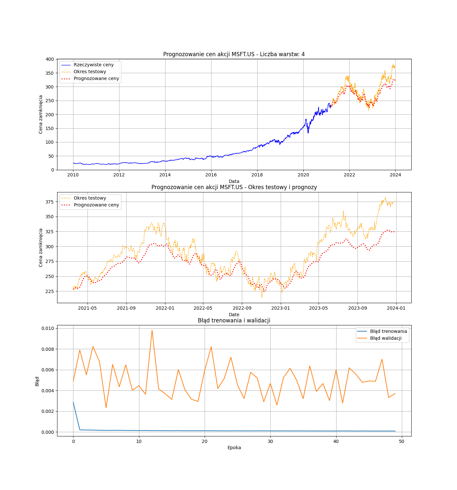
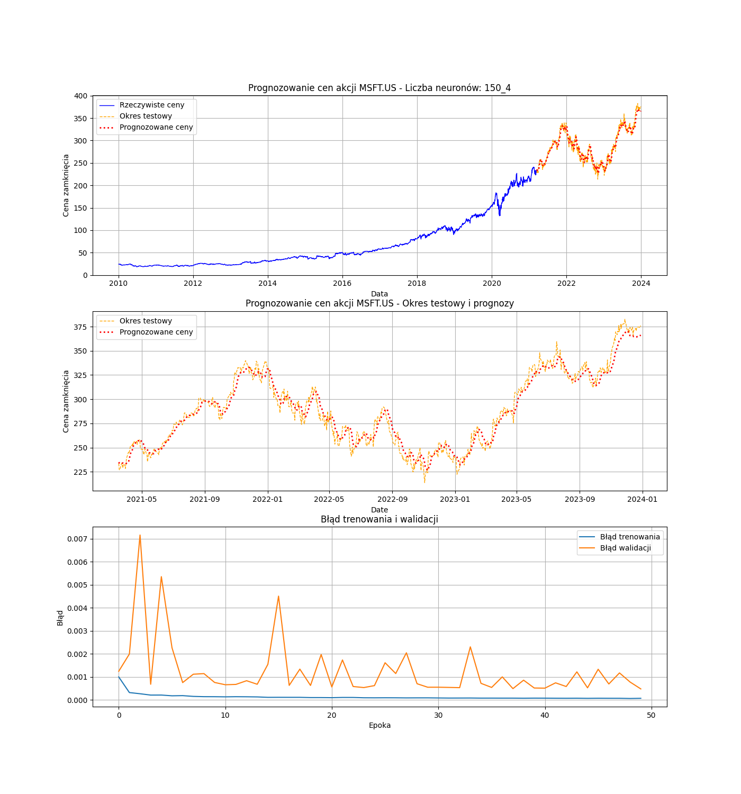
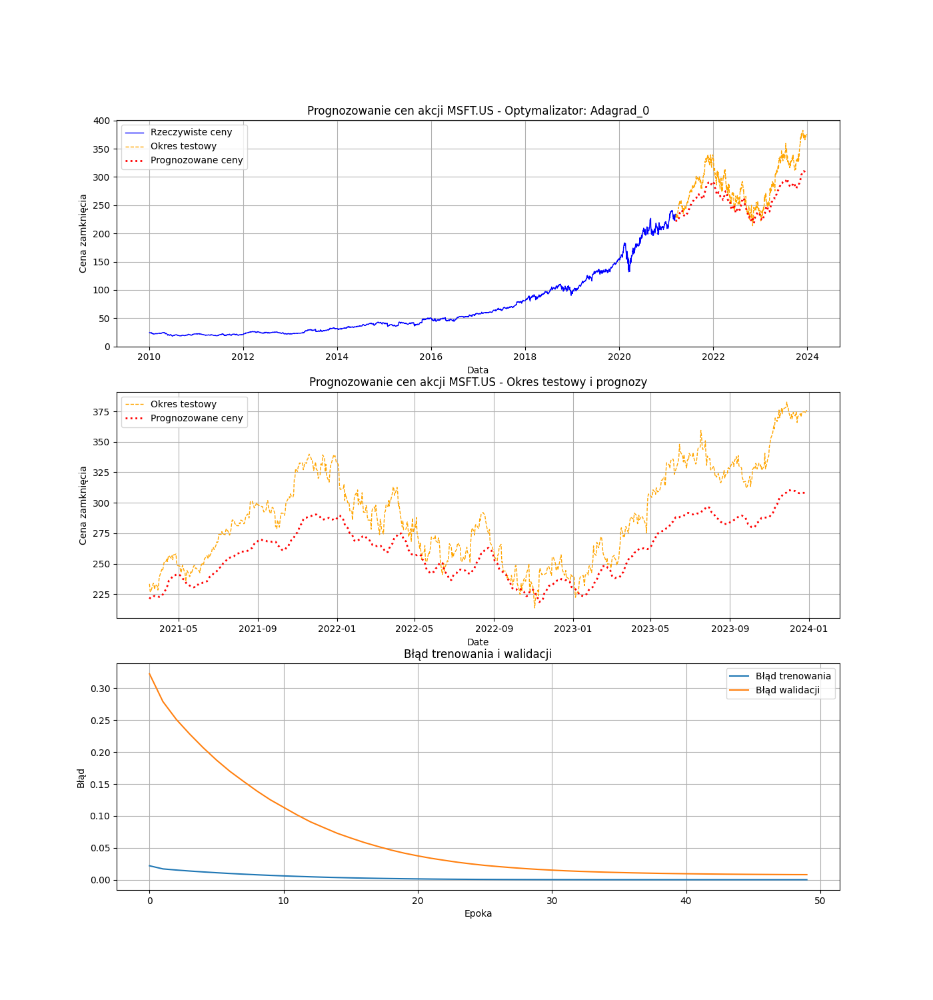
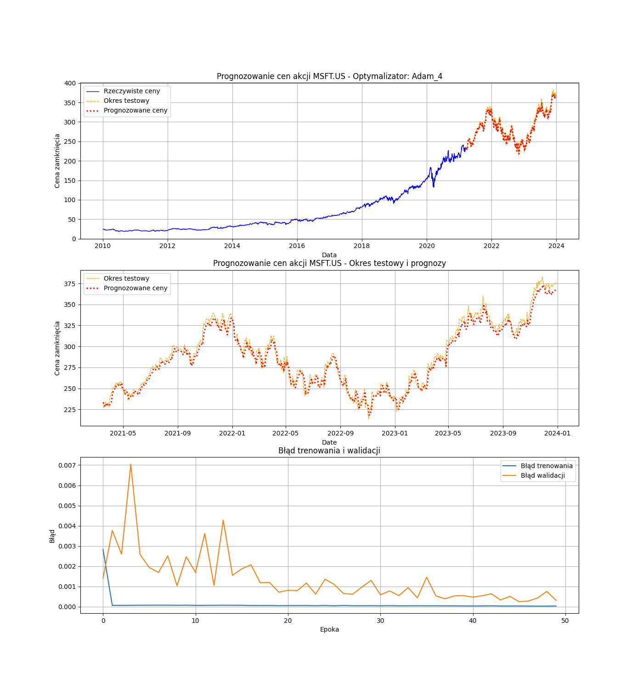
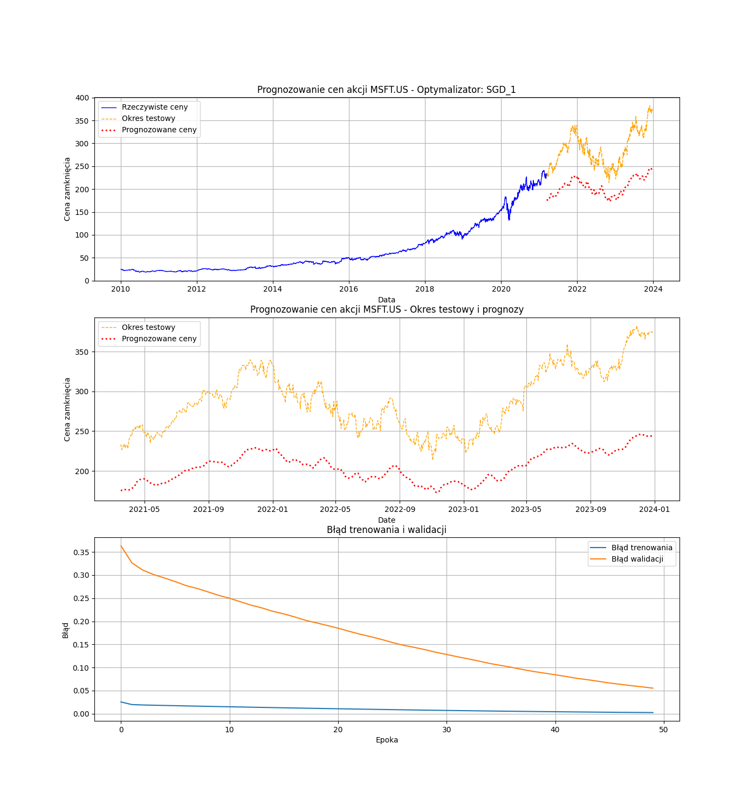

```{r setup, include=FALSE}
knitr::opts_chunk$set(echo = FALSE, warning = FALSE, message = FALSE)
```

```{r}
library(dplyr)
library(cowplot)
library(ggplot2)
library(readr)
library(readxl)
database <- read_csv("msft_us_historical_data.csv")
```

***

# Wprowadzenie 

***

<div style='text-align: justify'>
Umiejętność przewidywania zachowań spółek na giełdzie oraz identyfikacji spadków i wzrostów jest kluczową kompetencją współczesnych algorytmów działających na giełdzie. Szeroka gama narzędzi wspomaga maklerów w podejmowaniu decyzji o środkach, którymi obracają. W tej dziedzinie niezwykle pomocne okazują się sieci neuronowe, które są szeroko wykorzystywane do prognozowania cen na giełdzie.

W ramach badania postanowiono zbadać działanie rekurencyjnych sieci neuronowych (LSTM) na danych dotyczących notowań giełdowych spółki Microsoft od roku 2010. Zbiór treningowy stanowi 80% danych, natomiast działanie modelu jest testowane na ostatnich 20% danych.
</div>

<div style='text-align: justify'>
Modele LSTM charakteryzują się dużą liczbą parametrów, a ich dobór ma istotny wpływ na uzyskane wyniki. W badaniu postanowiono zbadać wpływ 5 różnych parametrów, testując dla każdego z nich 4 różne wartości.

Sprawdzanymi parametrami są; 

* **`Funkcja aktywacji`** - mechanizm, który decyduje o tym, jakie informacje mają zostać podane dalej w sieci, a które mają być zapomniane. 

  *Badane wartości: f.liniowa, f.sigmoidalna, f.ReLU, f.tangensa hiberbolicznego (tanh)*

* **`Rozmiar partii`** - liczba próbek, które są przetwarzane przez model w jednym przebiegu podczas uczenia. Wielkość partii znacząco wpływa na aktualizacje wag w trakcie treningu.

  *Badane wartości: 16, 32, 64, 128*

* **`Liczba wartstw`** - liczba poziomów, przez które przechodzą dane w trakcie prztwarzania. Im więcej takich warstw, tym głębsze są sieci. 

  *Badane wartości: 2, 3, 4, 5*

* **`Liczba neuronów`** - ilość neuronów w pojedynczej warstwie. W neuronie przetwarzane są informacje sieci za pomocą wybranych funkcji aktywacyjnych i przekazywane dalej.

  *Badane wartości: 50, 100, 150, 200*

* **`Optymalizator`** - algorytm działający w celu optymalizacji wag sieci, aby minimalizować błąd predykcji. 

  *Badane wartości: Adam, RMSprop, SGD, Adagrad*
</div>

***

## Dotychczasowe badania nad wykorzystaniem LSTM

***

<div style='text-align: justify'>
W ostatnich latach znaczną popularność zyskały zaawansowane metody sztucznej inteligencji, w tym sieci neuronowe typu Long Short-Term Memory (LSTM). Technologie te znajdują zastosowanie w prognozowaniu przyszłych cen akcji, które są uzależnione od licznych czynników zewnętrznych. W literaturze przedmiotu dostępnych jest wiele badań dotyczących wykorzystania sieci LSTM do predykcji cen akcji, ze szczególnym uwzględnieniem spółki Microsoft.

W artykule zatytułowanym *„Analysis and Forecast of Stock Price Based on LSTM Algorithm”* omówiono wykorzystanie modelu predykcyjnyjnego LSTM do prognozowania cen zamknięcia akcji firmy Microsoft. Wyniki analizy wskazują, iż model LSTM wykazuje wysoka skuteczność prognozowania, uzyskując wartość błędu RMSE o 24,43% niższą w porównaniu do regresji grzbietowej oraz 16,69% niższą w stosunku do klasycznej sieci neuronowej (Liu, 2021).

Podobnie, w publikacji *"Research on Microsoft Stock Price Prediction Based on Various Models"* skupiono się na analizie zastosowania różnych modeli predykcyjnych: regresji liniowej, ARIMA oraz LSTM w prognozowaniu cen akcji firmy Microsoft. Badanie obejmowało dane z okresu od kwietnia 2015 roku do kwietnia 2021 roku. Najlepsze rezultaty uzyskano w przypadku modelu LSTM, który osiągnął znacznie niższą wartość błędu RMSE w porównaniu do regresji liniowej oraz ARIMA. Podkreślono, że zdolność modelu LSTM do uchwycenia skomplikowanych, nieliniowych wzorców w danych czyni go wyjątkowo skutecznym narzędziem w analizie szeregów czasowych (Fu, 2024).

Z kolei w pracy *"Apple, Microsoft, and Amazon stock price prediction based on ARIMA and LSTM"* przeprowadzono analizę porównawczą modeli ARIMA oraz LSTM w kontekście prognozowania cen akcji trzech wiodących spółek technologicznych: Apple, Microsoft oraz Amazon. Wyniki badania wskazują, iż model ARIMA osiąga wyższą dokładność prognoz w porównaniu do modelu LSTM, co zostało ocenione za pomocą wskaźników RMSE oraz $\small R^2$. Zauważono jednak, że ograniczenia badania obejmowały pominięcie zewnętrznych czynników wpływających na ceny akcji oraz uproszczone podejście do optymalizacji modelu LSTM (Xia, 2024).
</div>

***

# Opis danych i metodyki

***

<div style='text-align: justify'>
Do predykcji cen firmy Microsoft wybrano model LSTM (Long Short-Term Memory), ponieważ modele LSTM są wysoce przydatne w modelowaniu danych sekwencyjnych czyli np. szeregów czasowych, którymi są odczyty cen zamknięcia z giełdy.

W celu użycia tego modelu, przeprowadzona została normalizacja danych do zakresu od 0 do 1, za pomocą wzoru:
</div>

$$
X' = \frac{X - \min(X)}{\max(X) - \min(X)}
$$
<div style='text-align: justify'>
Dodatkowo, dane wymagały podziału na sekwencje i odpowiadających im wartości docelowych. Na przykład dla zbioru [1,2,3,4,5] tworzymy dwa podzbiory [1,2,3] ,[2,3,4] oraz odpowiadające im etykiety: [4] i [5]. 
</div>

<div style='text-align: justify'>
Firma Microsoft została wybrana do badania ze względu na popularność spółki (przynależność do wielkiej piątki), i co za tym idzie, dużą ilość publikacji w związku z tą spółką. 
</div>

<br>
```{r, echo=FALSE, fig.align="center"}
split_index <- floor(0.8 * nrow(database))
split_date <- database$Date[split_index]

database %>%
  ggplot()+
  geom_line(aes(x = Date, y = Close)) +
  geom_vline(xintercept = as.numeric(split_date), color = "red", linetype = "dashed", size = 1) +
  theme_light(base_size = 15) +
  labs( title= "Microsoft - notowania na giełdzie", y = "Cena zamknięcia", x = "Data")
```

<div style='text-align: justify'>
Na wykresie można zauważyć dane, na których działano w badaniu. Czerwona linia zaznacza 80% danych, czyli po lewej stronie linii jest zbiór treningowy, natomiast po prawej stronie linii znajduje się zbiór testowy. 

W celu oceny dokładności prognozy i porównania wpływu zmiany parametrów obliczono:

- błąd walidacyjny

- średni błąd kwadratowy (RMSE)

$$
RMSE = \sqrt{\frac{1}{n} \sum_{i=1}^{n} (y_i - \hat{y}_i)^2}
$$

- R-kwadrat 

$$
R^2 = 1 - \frac{\sum_{i=1}^{n} (y_i - \hat{y}_i)^2}{\sum_{i=1}^{n} (y_i - \bar{y})^2}
$$
</div>
<br>

<div style='text-align: justify'>
Im wartość $\small RMSE$ jest bliższa 0, tym lepsza i dokładniejsza jest prognoza modelu.

Natomiast $\small R^2$ oznacza jaki procent $y$ został wyjaśnionych przez model. Im wartość bliższa 1 (100%), tym lepszy model, ponieważ wyjaśnia większy procent danych. 

W tabelach podano średnie $\small RMSE$ i $\small R^2$ ze wszystkich prób dla danych parametrów.

</div>

***

# Analiza wpływu różnych parametrów

***

<div style='text-align: justify'>
Łącznie przeprowadzono 100 prognozowań cen akcji, 5 razy dla każdego zestawu parametrów. Badano wpływ 5 różnych parametrów. W sprawozdaniu pokazywany będzie zestaw wykresów dla jednej z 5 prób przeprowadzonych dla wszystkich parametrów w celu zaoszczędzenia miejsca i długości sprawozdania. Dostęp do wykresów dla wszytskich prób przeprowadzonych w ramach badania jest w folderze 'plots', dołączonym do sprawozdania.
</div>

***

```{r, echo=FALSE, include=FALSE}
neurons <- read_excel("results.xlsx", sheet = "neurons")
optimizer <- read_excel("results.xlsx", sheet = "optimizer")
activation <- read_excel("results.xlsx", sheet = "activation")
batch_size <- read_excel("results.xlsx", sheet = "batch_size")
layers <- read_excel("results.xlsx", sheet = "layers")
```


## Funkcja aktywacji

***

<div style='text-align: justify'>
Na poniższych wykresach zaprezentowano wyniki dla 4 badanych funkcji aktywacji.
</div>

<br>
```{r fig.align="center"}
x <- seq(-10, 10, length.out = 500)
data <- data.frame(
  x = rep(x, 4),
  y = c(
    x,                                        # h(x) = x
    ifelse(x >= 0, x, 0),                    # h(x) = {x, x >= 0; 0, x < 0}
    1 / (1 + exp(-x)),                   # h(x) = 1 / (1 + e^(-x)) 
    2 / (1 + exp(-2 * x)) - 1                # h(x) = 2 / (1 + e^(-2x)) - 1
  ),
  function_name = factor(rep(
    c("f. liniowa", 
      "f. ReLU", 
      "f. sigmoidalna", 
      "f. tanh"), 
    each = length(x)
  ))
)

# Tworzenie wykresu
ggplot(data, aes(x = x, y = y, color = function_name)) +
  geom_line(size = 1.2) +
  labs(
    title = "Wykres funkcji aktywacyjnych h(x)",
    x = "x",
    y = "h(x)",
    color = "Funkcje"
  ) +
  theme_light(base_size = 14) +
  ylim(-1.5, 1.5)
```


Pozostałe parametry pozostają stałe:

* liczba neuronów = 20

* optymalizator = Adam

* rozmiar partii = 16

* liczba warstw  = 3

<br>

***

<br>
**Funkcja liniowa**

$$h(x) = x$$


```{r}
knitr::include_graphics("activation_linear_rep_3.png")
```

***

<br>
**Funkcja ReLU**

$$
h(x) = 
\begin{cases} 
x, & x \geq 0 \\ 
0, & x \leq 0 
\end{cases}
$$

```{r}
knitr::include_graphics("activation_relu_rep_2.png")
```

***

<br>
**Funkcja sigmoidalna**

$$
h(x) = \frac{1}{(1+e^{-x})}-1
$$

```{r}

```

***

<br>
**Funkcja tangens hiperboliczny**

$$
h(x) = \frac{2}{(1+e^{-2x})}-1
$$

```{r}
knitr::include_graphics("activation_tanh_rep_4.png")
```

**Przeciętny błąd prognozy**
<div style='text-align: justify'>
Błędy zostały policzone jako średnia dla wszystkich 5 prób
</div>
```{r, echo=FALSE}
act <- activation %>%
  group_by(Value) %>%
  summarise(
    RMSE = mean(RMSE),
    R2 = mean(R2)
  ) %>%
  as.data.frame() 

colnames(act) <- c("f.aktywacyjna", "RMSE", "R2")

act
```


<div style='text-align: justify'>
Najniższy błąd walidacji wyszedł w przypadku funkcji liniowej (~ 0.0015) oraz funkcji ReLU (~ 0.002), chociaż warto wspomnieć, że w przypadku dwóch prób, które można znaleźć w folderze plots, funkcja ReLU zaprognozowała same zera. Natomiast jej wartość $\small R^2$ oraz RMSE wskazują na całkowite niedopasowanie modelu. Wysokie wartości $\small RMSE$ i ujemne $\small R^2$ mogą wskazywać na możliwe przeszacowanie modelu lub niedoszacowanie. Natomiast zdecydowanie lepiej wypada funkcja liniowa, która ma najniższy błąd walidacyjny i $\small RMSE$ w porównaniu do reszty. $\small R^2$ ~ 0.9 wskazuje na dobre wyjaśnienie danych za pomocą modelu. Jednakże, pomimo iż błąd ten posiada najniższą wartość w porównaniu do pozostałych, wciąż pozostaje na stosunkowo wysokim poziomie.

Słabym dopasowaniem cechuje się funkcja sigmoidalna, gdzie błąd walidacji sięgnął 0.03, a $\small R^2$ wynosi zaledwie ~ 0.04. W wynikach dla tej funkcji można zauważyć zdecydowane niedoszacowanie w momencie, w którym spółka Microsoft osiągała wyższe ceny na giełdzie. Podobnie jest w przypadku użycia funkcji tanh.  
</div>

***

## Rozmiar partii

***

<div style='text-align: justify'>
Na poniższych wykresach zaprezentowano wyniki dla zwiekszającej się liczby próbek w partii.

Pozostałe parametry pozostają stałe:

* liczba neuronów = 20

* optymalizator = Adam

* funkcja aktywacji = f.liniowa

* liczba warstw  = 3
</div>

<br>

***

<br>
**16 próbek**

```{r}
knitr::include_graphics("batch_size_16_rep_1.png")
```

***

<br>
**32 próbki**

```{r}

```

***

<br>
**64 próbki**

```{r}

```

***

<br>
**128 próbek**

```{r}

```

```{r, echo=FALSE}
ba <- batch_size %>%
  group_by(Value) %>%
  summarise(
    RMSE = mean(RMSE),
    R2 = mean(R2)
  ) %>%
  as.data.frame() 
colnames(ba) <- c("Rozmiar partii", "RMSE", "R2")
ba
```

<div style='text-align: justify'>
Dla pierwszych trzech badanych rozmiarów partii różnica nie wydaje się znacząca. Błędy walidacji są bardzo podobne i oscylują wokół 0.003. Natomiast zwiększenie rozmiaru partii do 128 próbek, wprowadza pogorszenie się wyników i zwiekszenie błędu walidacji. Możemy to również zauważyć, po wartościach $\small RMSE$ i $\small R^2$. W przypadku $\small R^2$ widać nieznaczący spadek wraz ze wzrostem rozmiaru partii, natomiast dla $\small RMSE$ zaobserwowano lekki wzrost wartości wraz ze wzrostem rozmiaru partii.  Nie są to co prawda duże różnice, ale są zauważalne. Dopasowanie modeli nie jest najgorsze, $\small R^2$ ~ 0.8 pokazuje, że duża część danych została wyjaśniona przez model.
</div>

***

## Liczba warstw

***

<div style='text-align: justify'>
Poniżej zaprezentowano wykresy dla zwiększającej się liczby warstw w zbudowanym modelu. 

Pozostałe parametry pozostają stałe:

* liczba neuronów = 20

* optymalizator = Adam

* funkcja aktywacji = f.liniowa

* rozmiar partii = 16
</div>

<br>

***

<br>
**2 warstwy**

```{r}
knitr::include_graphics("layers_2_rep_1.png")
```

***

<br>
**3 warstwy**

```{r}

```

***

<br>
**4 warstwy**

```{r}

```

***

<br>
**5 warstw**

```{r}
knitr::include_graphics("layers_5_rep_1.png")
```

```{r, echo=FALSE}
lay <- layers %>%
  group_by(value) %>%
  summarise(
    RMSE = mean(rmse),
    R2 = mean(R2)
  ) %>%
  as.data.frame() 

colnames(lay) <- c("Liczba warstw", "RMSE", "R2")
lay
```

<div style='text-align: justify'>
Na wykresach można zauważyć zależność, że im więcej warstw, tym predykcja minimalnie gorsza. Widać to również po $\small R^2$ i $\small RMSE$. Wraz ze wzrostem liczby warstw maleje $R^2$ i rośnie $\small RMSE$ w znaczącym stopniu. Już dla 5 warstw wyjaśniane jest tylko 44% danych przez model, a $\small RMSE$ wynosi 28.885. Natomiast dla 2 warstw wyjaśniane jest aż 95% danych i $\small RMSE$ to tylko 8.42.

</div>

***

## Liczba neuronów

***

<div style='text-align: justify'>
Poniżej zaprezentowano wykresy dla zwiększającej się liczby neuronów w warstwach w zbudowanym modelu. 

Pozostałe parametry pozostają stałe:

* liczba warstw = 3

* optymalizator = Adam

* funkcja aktywacji = f.liniowa

* rozmiar partii = 16
</div>

<br>

***

<br>
**50 neuronów**

```{r}
knitr::include_graphics("neurons_50_rep_0.png")
```

***

<br>
**100 neuronów**

```{r}
knitr::include_graphics("neurons_100_rep_1.png")
```

***

<br>
**150 neuronów**

```{r}

```

***

<br>
**200 neuronów**

```{r}
knitr::include_graphics("neurons_200_rep_3.png")
```

```{r, echo=FALSE}
ne <- neurons %>%
  group_by(Value) %>%
  summarise(
    RMSE = mean(RMSE),
    R2 = mean(R2)
  ) %>%
  as.data.frame() 

colnames(ne) <- c("Liczba neuronów", "RMSE", "R2")
ne
```

<div style='text-align: justify'>
Błąd walidacyjny w większości przypadków waha się wokół 0.001. Dla liczby neuronów = 200, jest on jednak niższy. We wszystkich sytuacjach występują duże wahania błędu walidacyjnego. 

Wraz ze wzrostem liczby neuronów w modelu rośnie stopień dopasowania modelu do danych, co znajduje odzwierciedlenie w wysokim $\small R^2$, wyjaśniającym ponad 90% zmienności danych.

$\small RMSE$ zmniejsza się wraz ze wzrostem liczby neuronów, co oznacza lepsze dopasowanie modelu. Na początku spadek $\small RMSE$ jest dość znaczący, jednak przy większej liczbie neuronów różnice stają się mniej zauważalne. Mimo to, wartość $\small RMSE$ pozostaje dość wysoka, wynosząc blisko 10 dla wszystkich analizowanych parametrów.
</div>

***

## Optymalizator

***

<div style='text-align: justify'>
Poniżej zaprezentowano wykresy dla różnych optymalizatorów w zbudowanym modelu. 

Pozostałe parametry pozostają stałe:

* liczba warstw = 3

* liczba neuronów = 20

* funkcja aktywacji = f.liniowa

* rozmiar partii = 16
</div>

<br>

***

<br>
**Adagrad**

<div style='text-align: justify'>
Adagrad automatycznie dostosowuje krok optymalizacji dla każdego parametru w oparciu o historię gradientów. Wagi, które często mają duże gradienty, otrzymują mniejsze kroki optymalizacji. Parametry rzadko aktualizowane mają większe kroki optymalizacji.
</div>

```{r}

```

<div style='text-align: justify'>
Dla optymalizatora Adagrad można zauważyć, że błąd walidacyjny zmierza do błędu trenowania. Wykres błędu różni się zdecydowanie od  wykresów w innych przypadkach. Nie mamy tutaj takich wahań, ale dla początkowych epok wartości błędu są dość wysokie. Prognoza dość mocno się różni od rzeczywistych wartości.
</div>

***

<br>
**Adam**

<div style='text-align: justify'>
Adam utrzymuje zbiór wykładniczo malejących średnich poprzednich gradientów i kwadratowych gradientów. Oblicza pierwszy i drugi moment gradientów, które są odpowiednio oszacowaniami średniej i niecentrowanej wariancji gradientów. Te momenty są następnie wykorzystywane do aktualizacji parametrów modelu.
</div>

```{r}

```

<div style='text-align: justify'>
Dla optymalizatora Adam błąd już zaczyna się wahać. Jednak na przestrzeni wszystkich epok błąd jest bardzo niski. Powyżej 20 epok jest on niższy niż 0.001. Tutaj prognoza jest praktycznie identyczna jak rzeczywiste wartości, stąd też takie niskie wartości błędu.
</div>

***

<br>
**RMSprop**

<div style='text-align: justify'>
RMSprop to ulepszenie SGD, które dynamicznie dostosowuje krok optymalizacji w zależności od gradientów. Skaluje krok optymalizacji w zależności od wielkości gradientu – mniejsze kroki dla dużych gradientów i większe dla małych gradientów.
</div>

```{r}
knitr::include_graphics("optimizer_RMSprop_rep_2.png")
```

<div style='text-align: justify'>
Dla optymalizatora RMSprop również mamy duże wahania błędu. Jednak wartości są bardzo niskie, zwłaszcza w porównaniu do optymalizatora Adagrad. Natomiast błąd nie schodzi tutaj tak nisko jak w przypadku opt. Adam. Tutaj dopasowanie prognozy też jest bardzo dobre.
</div>

***

<br>
**SGD**

<div style='text-align: justify'>
SGD aktualizuje parametry w małych partiach danych treningowych, dzięki czemu jest wydajny obliczeniowo. Dostosowuje parametry w kierunku najbardziej stromego spadku funkcji straty, stopniowo zbiegając się w kierunku minimum.
</div>

```{r}

```

<div style='text-align: justify'>
Dla optymalizatora SGD ponownie jest sytuacja taka, jak dla opt. Adagrad. Wartości błędu na przestrzeni epok są bardzo wysokie. Maleje zdecydowanie wolniej niż w innych przypadkach. Wypada on tutaj najgorzej. Możemy to też zobaczyć po prognozie cen, że uzyskane wyniki znacząco się różnią od rzeczywistych. 
</div>

```{r, echo=FALSE}
op <- optimizer %>%
  group_by(Value) %>%
  summarise(
    RMSE = mean(RMSE),
    R2 = mean(R2)
  ) %>%
  as.data.frame()
colnames(op) <- c("Optymalizator", "RMSE", "R2")

op
```

<div style='text-align: justify'>

Adam wykazuje najlepsze wyniki pod względem $\small RMSE$ i $\small R^2$. Niskie wartości $\small RMSE$ wskazują na dobre dopasowanie modelu do danych, a wysokie $\small R^2$ sugeruje, że model wyjaśnia prawie całą zmienność danych. Dla RMSprop wartości $\small RMSE$ są wyższe niż w przypadku Adama, $\small R^2$ jest nadal wysokie, co oznacza, że model jest dość dobrze dopasowany do danych. W przypadku Adagrad zarówno $\small RMSE$, jak i $\small R^2$ zdecydowanie gorzej wypadają w porównaniu do dwóch poprzednich optymalizatorów. Natomiast najgorzej wypada SGD. $\small RMSE$ jest bardzo wysokie, a $\small R^2$ ujemne, co oznacza, że model jest całkowicie niedopasowany do danych. Potwierdzają to również prognozy, które są dalekie od rzeczywistych.

Najlepiej zdecydowanie wypada optymalizator Adam. Daje on najniższe wartości błędu i prognoza jest najlepiej dopasowana do rzeczywistych wartości. Najgorzej natomiast wypada optymalizator SGD. W odróżnieniu od pozostałych nie wykorzystuje on adaptacyjnego tempa uczenia.
</div>

***

# Podsumowanie

***

<div style='text-align: justify'>
Przeprowadzona analiza umożliwiła zbadanie wpływu kluczowych parametrów modelu LSTM na skuteczność predykcji cen akcji spółki Microsoft. Badanie dotyczyło wpływu wielkości następujących parametrów: funkcji aktywacji, rozmiaru partii, liczby warstw, liczby neuronów oraz wyboru optymalizatora. Uzyskane wyniki wskazały na występowanie istotnej zależności pomiędzy doborem parametrów a jakością prognoz, co zostało szczegółowo omówione poniżej:

* **`Funkcja aktywacji`**: funkcje liniowa oraz ReLU okazały się najbardziej skuteczna w kontekście prognozowania, wykazując mniejsze błędy walidacji w porównaniu z innymi funkcjami. Pozostałe z analizowanych funkcji tj. funkcja tangensa hiperbolicznego oraz funkcja sigmoidalna cechują się słabym dopasowaniem.

* **`Rozmiar partii`**: w przypadku rozmiarów partii odpowiednio: 16, 32 oraz 64 wystepowały zbliżone wartości błędów walidacji. Zwiększenie rozmiaru partii do 128 próbek spowodowało pogorszenie uzyskanych wyników. 

* **`Liczba warstw`**: zwiększenie liczby warstw prowadziło do pogorszenia predykcji i występowania większych błędów walidacji.

* **`Liczba neuronów`**: we wszystkich analizowanych przypadkach występują znaczące wahania błędów walidacyjnych, jednakże w przypadku liczby neuronów wynoszącej 200 można zauważyć niższe wartości tego błędu.

* **`Optymalizator`**: optymalizator Adam wykazał się najniższymi wartościami błędów walidacyjnych oraz najwyższym stopniem dopasowania wartości do danych rzeczywistych. Najgorzsze wyniki osiągnął optymalizator SGD, gdyż w porównaniu do pozostałych nie stosuje adaptacyjnego tempa uczenia.
</div>

***

# Porównanie wyników

***

<div style='text-align: justify'>
Ponad samą prognozę oraz wyznaczenie błędów predykcji, postanowiono porównać wyniki dopasowania naszego modelu z innymi rozwiązaniami wykorzystywanymi na świecie. 

Nasze wyniki zostały porównane do czterech innych rozwiązań pod względem wysokości błędu $\small RMSE$ oraz wskaźnika $\small R^2$.

Wybrane metody do porówania:

* **`Model ARIMA`**

* **`Model GRU`**

* **`Model regresji liniowej`**

* **`Model regresji wektora nośnego (SVR)`**
</div>
<br>
<div style='text-align: justify'>
W porówaniu zestawiono $\small RMSE$ oraz $\small R^2$  dla naszego najlepszego modelu. Najlepszy wynik został osiągnięty dla następujących wartości parametrów: 

* liczba warstw = 3

* liczba neuronów = 20

* funkcja aktywacji = f.liniowa

* rozmiar partii = 16

* optymalizator = Adam
</div>

***

## LSTM vs ARIMA

***

<div style='text-align: justify'>
W artykule *„Apple, Microsoft, and Amazon stock price prediction based on ARIMA and LSTM”* dokonano porównania modeli **ARIMA** oraz **LSTM** w kontekście prognozowania. 
ARIMA to jedna z najpopularniejszych metod modelowania szeregów czasowych. Skrót ARIMA opisuje jej trzy kluczowe komponenty:

- AR (Autoregressive): Model autoregresyjny opisuje zależność wartości szeregu czasowego od jego wcześniejszych wartości. Parametr p określa liczbę opóźnionych wartości branych pod uwagę.

- I (Integrated): Część "zintegrowana" oznacza różnicowanie szeregu czasowego w celu usunięcia trendu lub uzyskania stacjonarności. Parametr d określa liczbę takich różnicowań.

- MA (Moving Average): Model średniej ruchomej opisuje zależność wartości szeregu od błędów z poprzednich kroków. Parametr  q określa liczbę takich błędów branych pod uwagę.

Dla spółki Microsoft wykorzystano dane z 1 września 2021 do 29 września 2023. Zatem ilość danych była zdecydowanie mniejsza niż w naszym badaniu. Zasotowano również inny podział danych: 60% to zbiór treningowy, 20% zbiór walidaycjny i ostatnie 20% to zbiór testowy.

```{r, echo=FALSE}
methods <- c("LSTM", "ARIMA", "LSTM")
source <- c("Artykuł", "Artykuł", "Nasz wynik")
RMSE <- c(5.09, 1.87, 6.56)
R2 <- c(0.78, 0.97, 0.97)
	
results <- data.frame(
  Metoda = methods,
  Źródło = source,
  RMSE = RMSE,
  R2 = R2
)
results
```

$\small R^2$ wypada bardzo podobnie dla naszego LSTM i ARIMY. Natomiast ARIMA osiągnęła znacznie niższy błąd (1.8729) w porównaniu do naszego LSTM (6.5589), co wskazuje, że ARIMA lepiej przewidziała dane w przypadku tych danych. Wyniki LSTM z artykułu mają nieco niższy błąd $\small RMSE$, ale zdecydowanie niższy $\small R^2$. Parametry przyjęte w artykule dla LSTM różniły sie znacząco stąd też mogły wyjść rozbieżne wyniki.

Arima wykazuje lepszą dokładnością w prognozowaniu cen akcji ze względu na wskaźniki $\small RMSE$ i $\small R^2$. LSTM jest bardziej wymagające pod kątem dobrania odpowiednich parametrów i ich wartości. 
</div>

***

## LSTM vs GRU

***

<div style='text-align: justify'>
W artykule *Predicting Economic Trends and Stock Market Prices with Deep Learning and Advanced Machine Learning Techniques* autorzy porównywali wyniki predykcji i ich jakość dla dwóch modeli: **LSTM** oreaz **GRU**. Badanie przeprowadzono na danych od 2013 do 2022. 

GRU (Gated Recurrent Unit) to rodzaj sieci rekurencyjnej (RNN) opracowany w 2014 roku w celu rozwiązania problemu zanikającego gradientu w tradycyjnych RNN. Jego główne zalety to mniejsza liczba parametrów, szybsze uczenie i mniejsze wymagania dotyczące danych potrzebnych do generalizacji.

GRU posiada dwa główne mechanizmy:

* Zbiór bramek:
  Brama resetująca decyduje, ile informacji z przeszłości zostaje "zapomniane".
  Brama aktualizująca kontroluje, ile nowych informacji jest dodawane do stanu ukrytego.
  
* Stan ukryty: Jest bezpośrednio aktualizowany na podstawie tych bramek, co upraszcza strukturę i obliczenia w porównaniu do LSTM (które posiadają dodatkowy stan pamięci).

Dzięki temu GRU jest bardziej efektywne w przetwarzaniu sekwencji niż standardowe RNN i LSTM, szczególnie przy ograniczonych zasobach obliczeniowych.

```{r}
methods <- c("LSTM", "GRU", "LSTM")
source <- c("Artykuł", "Artykuł", "Nasz wynik")
RMSE <- c(32.37, 8.08, 6.56)
R2 <- c(0.70, 0.83, 0.97)
	
results <- data.frame(
  Metoda = methods,
  Źródło = source,
  RMSE = RMSE,
  R2 = R2
)
results
```

Wyniki dla modelu GRU i LSTM z artykułu są słabe w porówaniu z naszymi  wynikami. $\small RMSE$ wyszedł naprawde wysoki, do tego $\ small R^2$ nie jest nawet powyżej 90%, co jak widać po wynikach dla innych metod, jest osiągalne.

Pomimo wielu zalet modelu GRU w porówaniu do LSTM, to niestety ciężko stwierdzić, że jest on warty zastosowania w praktyce. 
</div>

***

## LSTM vs Regresja liniowa 

***

<div style='text-align: justify'>
W publikacji *"Ensemble Stock Market Prediction using SVM, LSTM, and Linear Regression"* porównano efektywność prognozowania trzech modeli: **SVM**, **LSTM** oraz **regresji liniowej**. 

Regresja liniowa stanowi jedną z najczęściej stosowanych metod analizy predykcyjnej. Metoda ta opiera się na relacjach liniowych pomiędzy zmienną zależną (wyjaśnianą) a jedną lub większą liczbą zmiennych niezależnych (predyktorów), w celu prognozowania wartości przyszłych zmiennej przewidywanej.

Przedmiotem badania były dane dwudziestu najbardziej aktywnych spółek z indeksu NASDAQ z zakresu od 21 września 2009 do 21 września 2019. Warto wspomnieć, iż w przypadku zastosowanego przez nas modelu LSTM zakres danych jest większy, gdyż sięga 2024 roku. 

W tabeli zamieszczonej poniżej dokonano zestawienia błędów $\small R^2$ oraz $\small RMSE$ dla predykcji rozważanych modeli. Ze względu na analizowanie przez nas jedynie spółki Microsoft przy porównywaniu wyników uwzględniona zostanie tylko ta spółka.

```{r, echo=FALSE}
methods <- c("LSTM", "LR", "LSTM")
source <- c("Artykuł", "Artykuł", "Nasz wynik")
RMSE <- c(1.57, 1.39, 6.56)
R2 <- c(0.96, 1.00, 0.97)
	
results <- data.frame(
  Metoda = methods,
  Źródło = source,
  RMSE = RMSE,
  R2 = R2
)
results
```

Mimo różnicy w liczbie rozważanych danych czasowych wartość $\small R^2$ dla LSTM w naszym badaniu oraz w przytoczonej pubikacji jest bardzo zbliżona. Jeśli chodzi o wartości $\small RMSE$ są one najbardziej podobne dla LSTM oraz regresji liniowej dla wyników zaprezentowanych w artykule, nasz LSTM wypada na ich tle słabiej. Zadziwiające są wyniki $\small R^2$ dla regresji liniowej, ponieważ wskazują one na 100% wytłumaczenie zmienności danych, co jest najwyższym wynikiem z wszystkich omawianych w naszej pracy.
</div>


*** 

## LSTM vs SVR

***

<div style='text-align: justify'>
W wyżej opisanym artykule zastosowano również model **regresji wektora nośnego** (SVR), który stanowi adaptację SVM do problemów regresji, co czyni go bardziej odpowiednim do przewidywania wartości ciągłych, takich jak ceny akcji, w przeciwieństwie do pierwotnej funkcji SVM.


```{r, echo=FALSE}
methods <- c("LSTM", "SVR", "LSTM")
source <- c("Artykuł", "Artykuł", "Nasz wynik")
RMSE <- c(1.57, 7.25, 6.56)
R2 <- c(0.96, 0.03, 0.97)
	
results <- data.frame(
  Metoda = methods,
  Źródło = source,
  RMSE = RMSE,
  R2 = R2
)
results
```

Widoczna jest tu znaczna różnica pomiędzy wartością dla SVR a pozostałymi modelami. $\small R^2$ wskazuje na to że model w ogóle nie tłumaczy zmienności y. Dodatkowo $\small RMSE$, wyszło najwyższe z porównywanych w tym podrozdziale metod. Takie wyniki wskazują na kompletną bezużyteczność modelu SVR w predykcji cen firmy Microsoft na giełdzie.
</div>

***

## Podsumowanie wyników porównań

***

<div style='text-align: justify'>
Na poniższych wykresach, zwizualizowano wyniki $\small RSME$ oraz $\small R^2$ odpowiednio dla wszystkich omawianych modeli LSTM oraz wszystkich opisanych wyżej metod. 
</div>

***

```{r fig.align="center"}
wykres_RMSE <- data.frame(
  Model = c("LSTM1", "LSTM2", "LSTM3", "Nasz LSTM"),
  RMSE = c(5.0984, 32.37, 1.57, 6.56), 
  R2 = c(0.7806,0.70,0.96,0.97)
)

# Wykres słupkowy
ggplot(wykres_RMSE, aes(x = Model, y = RMSE, fill = Model)) +
  geom_bar(stat = "identity", width = 0.6, show.legend = FALSE) +
  scale_fill_manual(values = c("LSTM1" = "#1f77b4", "LSTM2" = "orange", "LSTM3" = "#458B00", "Nasz LSTM" = "#CD1076")) +
  labs(title = "Porównanie RMSE dla różnych modeli LSTM",
       x = "Model",
       y = "RMSE") +
  theme_light() +
  theme(
    plot.title = element_text(hjust = 0.5, size = 16, face = "bold"),
    axis.text = element_text(size = 12),
    axis.title = element_text(size = 14)
  )
```

<br>
```{r fig.align="center"}
ggplot(wykres_RMSE, aes(x = Model, y = R2, fill = Model)) +
  geom_bar(stat = "identity", width = 0.6, show.legend = FALSE) +
  scale_fill_manual(values = c("LSTM1" = "#1f77b4", "LSTM2" = "orange", "LSTM3" = "#458B00", "Nasz LSTM" = "#CD1076")) +
  labs(title = "Porównanie R2 dla różnych modeli LSTM",
       x = "Model",
       y = "R2") +
  theme_light() +
  theme(
    plot.title = element_text(hjust = 0.5, size = 16, face = "bold"),
    axis.text = element_text(size = 12),
    axis.title = element_text(size = 14)
  )
```

<div style='text-align: justify'>
Z omawianych modeli LSTM tworzonych w ramach różnych badań, najgorzej wypadł model LSTM2. Ten model pochodzi z badania *Predicting Economic Trends and Stock Market Prices with Deep Learning and Advanced Machine Learning Techniques.* i cechuje go najwyższe $\small RMSE$ i najniższy $\small R^2$. Zbudowany przez nas model LSTM wypadł w miarę dobrze, na tle innych modeli LSTM. Wykazał się najwyższym tłumaczeniem zmienności y, z wszystkich omawianych modeli. Problem powoduje wysoki błąd $\small RMSE$, który jak widać, może wyjść o wiele niższy. 
</div>

***

```{r fig.align="center"}
wykres_RMSE <- data.frame(
  Model = c("ARIMA", "GRU", "LR","SVR", "Nasz LSTM"),
  RMSE = c(1.87, 8.08, 1.39,  7.25,6.56), 
  R2 = c(0.97,0.83,1, 0.03,0.97)
)

# Wykres słupkowy
ggplot(wykres_RMSE, aes(x = Model, y = RMSE, fill = Model)) +
  geom_bar(stat = "identity", width = 0.6, show.legend = FALSE) +
  scale_fill_manual(values = c("ARIMA" = "#1f77b4", "GRU" = "orange", "LR" = "#458B00","SVR" = "#8B3E3F", "Nasz LSTM" = "#CD1076")) +
  labs(title = "Porównanie RMSE dla różnych modeli predykcyjnych",
       x = "Model",
       y = "RMSE") +
  theme_light() +
  theme(
    plot.title = element_text(hjust = 0.5, size = 16, face = "bold"),
    axis.text = element_text(size = 12),
    axis.title = element_text(size = 14)
  )
```

<br>
```{r fig.align="center"}
ggplot(wykres_RMSE, aes(x = Model, y = R2, fill = Model)) +
  geom_bar(stat = "identity", width = 0.6, show.legend = FALSE) +
  scale_fill_manual(values = c("ARIMA" = "#1f77b4", "GRU" = "orange", "LR" = "#458B00","SVR" = "#8B3E3F", "Nasz LSTM" = "#CD1076")) +
  labs(title = "Porównanie R2 dla różnych modeli predykcyjnych",
       x = "Model",
       y = "R2") +
  theme_light() +
  theme(
    plot.title = element_text(hjust = 0.5, size = 16, face = "bold"),
    axis.text = element_text(size = 12),
    axis.title = element_text(size = 14)
  )
```

<div style='text-align: justify'>
Z wszystkich porównywanych modeli predykcyjnych, najlepsze wyniki okazały się należeć do modelu regresji liniowej, zbudowanego w artykule *Ensemble Stock Market Prediction using SVM,LSTM, and Linear Regression*. Nie dość że model osiągnął 100% wytłumaczalność zmienności danych, to do tego ma najniższy błąd $\small RSME$, co bezsprzecznie stawia go na pierwszym miejscu wśród omawianych technik. Do tego zdecydowanie najgorszy jest model SVR. 

Zbudowany przez nas model LSTM nie wypada najgorzej, jednak widać możliwości na poprawę jego wyników. 
</div>

***

# Bibliografia 

***

1. Chang, V., Xu, Q. A., Chidozie, A., Wang, H., & Marino, S. (2024). *Predicting Economic Trends and Stock Market Prices with Deep Learning and Advanced Machine Learning Techniques.* Electronics, 13(17), 3396.

2. Fu, Y. (2024). *Research on Microsoft Stock Price Prediction Based on Various Models*. Proceedings of the 1st International Conference on Data Science and Engineering, 11–16

3. Indika, A., Warusamana, N., Welikala, E., & Deegalla, S. (2021). *Ensemble Stock Market Prediction using SVM,LSTM, and Linear Regression*, https://doi.org/10.36227/techrxiv.16626019.v1

4. Liu, Y. (2021). *Analysis and forecast of stock price based on LSTM algorithm*. 2021 IEEE International Conference on Computer Science, Electronic Information Engineering and Intelligent Control Technology (CEI), Fuzhou, China, 76-79

5. Wall, K. (2022). *Negative R2: Where did you go wrong*. Towards Data Science, https://towardsdatascience.com/negative-r2-where-did-you-go-wrong-9d4f2aa84cfb

6. Xia, X. (2024). *Apple, Microsoft, and Amazon stock price prediction based on ARIMA and LSTM*. Applied and Computational Engineering, 53(1), 181–189


