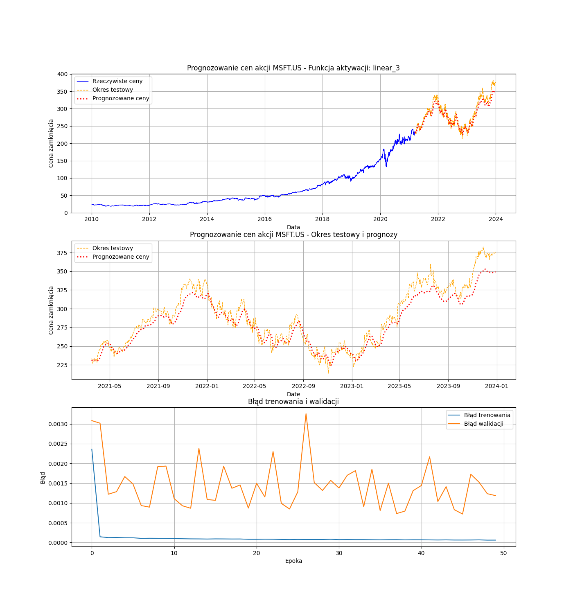
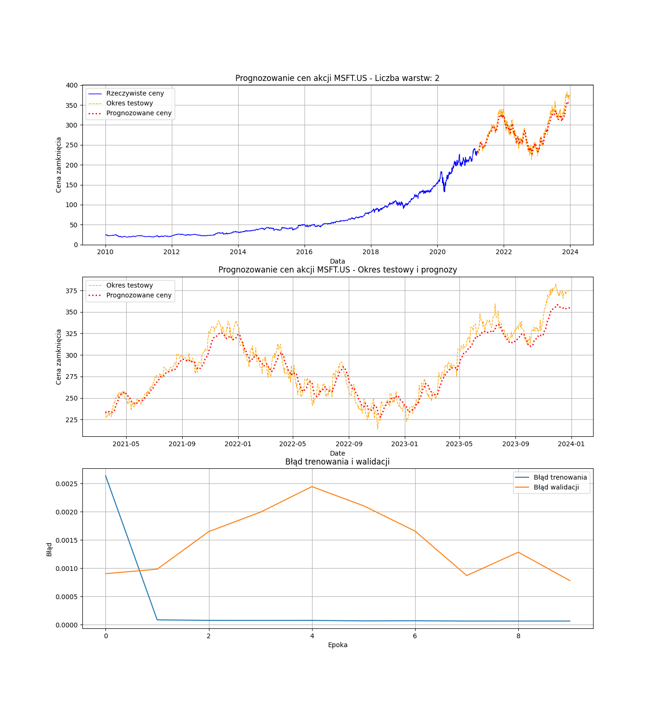
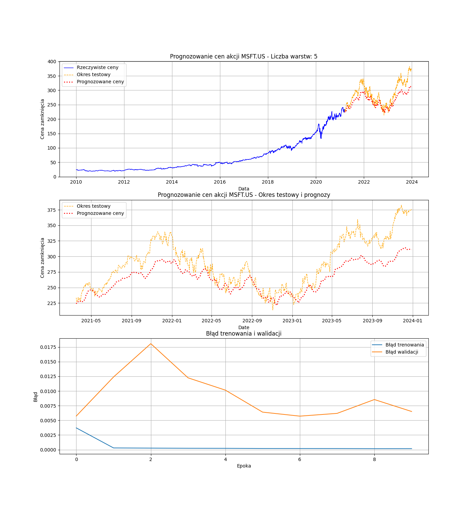

```{r setup, include=FALSE}
knitr::opts_chunk$set(echo = FALSE, warning = FALSE, message = FALSE)
```

```{r}
library(dplyr)
library(cowplot)
library(ggplot2)
library(readr)
database <- read_csv("msft_us_historical_data.csv")
```

***

# Wprowadzenie 

***

<div style='text-align: justify'>
Umiejętność przewidywania zachowań spółek na giełdzie oraz identyfikacji spadków i wzrostów jest kluczową kompetencją współczesnych algorytmów działających na giełdzie. Szeroka gama narzędzi wspomaga maklerów w podejmowaniu decyzji o środkach, którymi obracają. W tej dziedzinie niezwykle pomocne okazują się sieci neuronowe, które są szeroko wykorzystywane do prognozowania cen na giełdzie.

W ramach badania postanowiono zbadać działanie rekurencyjnych sieci neuronowych (LSTM) na danych dotyczących notowań giełdowych spółki Microsoft od roku 2010. Zbiór treningowy stanowi 80% danych, natomiast działanie modelu jest testowane na ostatnich 20% danych.
</div>

<div style='text-align: justify'>
Modele LSTM charakteryzują się dużą liczbą parametrów, a ich dobór ma istotny wpływ na uzyskane wyniki. W badaniu postanowiono zbadać wpływ 5 różnych parametrów, testując dla każdego z nich 4 różne wartości.

Sprawdzanymi parametrami są; 

* **Funkcja aktywacji** - mechanizm, który decyduje o tym, jakie informacje mają zostać podane dalej w sieci, a które mają być zapomniane. 

  *Badane wartości: f.liniowa, f.sigmoidalna, f.ReLU, f.tangensa hiberbolicznego (tanh)*

* **Rozmiar partii** - liczba próbek, które są przetwarzane przez model w jednym przebiegu podczas uczenia. Wielkość partii znacząco wpływa na aktualizacje wag w trakcie treningu.

  *Badane wartości: 16, 32, 64, 128*

* **Liczba wartstw** - liczba poziomów, przez które przechodzą dane w trakcie prztwarzania. Im więcej takich warstw, tym głębsze są sieci. 

  *Badane wartości: 2, 3, 4, 5*

* **Liczba neuronów** - ilość neuronów w pojedynczej warstwie. W neuronie przetwarzane są informacje sieci za pomocą wybranych funkcji aktywacyjnych i przekazywane dalej.

  *Badane wartości: 50, 100, 150, 200*

* **Optymalizator** - algorytm działający w celu optymalizacji wag sieci, aby minimalizować błąd predykcji. 

  *Badane wartości: Adam, RMSprop, SGD, Adagrad*
</div>

***

# Opis danych i metodyki

***

<div style='text-align: justify'>
Do predykcji cen firmy Microsoft wybrano model LSTM (Long Short-Term Memory), ponieważ modele LSTM są wysoce przydatne w modelowaniu danych sekwencyjnych czyli np. szeregów czasowych, którymi są odczyty cen zamknięcia z giełdy.

W celu użycia tego modelu, przeprowadzona została normalizacja danych do zakresu od 0 do 1, za pomocą wzoru:
</div>

$$
X' = \frac{X - \min(X)}{\max(X) - \min(X)}
$$
<div style='text-align: justify'>
Dodatkowo, dane wymagały podziału na sekwencje i odpowiadających im wartości docelowych. Na przykład dla zbioru [1,2,3,4,5] tworzymy dwa podzbiory [1,2,3] ,[2,3,4] oraz odpowiadające im etykiety: [4] i [5]. 
</div>

<div style='text-align: justify'>
Firma Microsoft została wybrana do badania ze względu na popularność spółki (przynależność do wielkiej piątki), i co za tym idzie, dużą ilość publikacji w związku z tą spółką. 
</div>
```{r, echo=FALSE}
split_index <- floor(0.8 * nrow(database))
split_date <- database$Date[split_index]

database %>%
  ggplot()+
  geom_line(aes(x = Date, y = Close)) +
  geom_vline(xintercept = as.numeric(split_date), color = "red", linetype = "dashed", size = 1) +
  theme_light(base_size = 15) +
  labs( title= "Microsoft - notowania na giełdzie", y = "Cena zamknięcia", x = "Data")
```

<div style='text-align: justify'>
Na wykresie można zauważyć dane, na których działano w badaniu. Czerwona linia zaznacza 80% danych, czyli po lewej stronie linii jest zbiór treningowy, natomiast po prawej stronie linii znajduje się zbiór testowy.
</div>

***

# Wyniki

***

<div style='text-align: justify'>
Łącznie przeprowadzono 100 prognozowań, 5 razy dla każdego zestawu parametrów. Badano wpływ 5 różnych parametrów. W sprawozdaniu pokazywany będzie zestaw wykresów dla jednej z 5 prób przeprowadzonych dla wszystkich parametrów w celu zaoszczędzenia miejsca i długości sprawozdania. Dostęp do wykresów dla wszytskich prób przeprowadzonych w ramach badania jest w folderze 'plots', dołączonym do sprawozdania.
</div>

***

## Funkcja aktywacji

***

<div style='text-align: justify'>
Na poniższych wykresach zaprezentowano wyniki dla 4 badanych funkcji aktywacji. 

Pozostałe parametry pozostają stałe:

* liczba neuronów = 20

* optymalizator = Adam

* rozmiar partii = 16

* liczba warstw  = 3

<br>

***

<br>
**Funkcja liniowa**

$$h(x) = x$$

```{r}

```

***

<br>
**Funkcja ReLU**

$$
h(x) = 
\begin{cases} 
x, & x \geq 0 \\ 
0, & x \leq 0 
\end{cases}
$$

```{r}
knitr::include_graphics("activation_relu_rep_2.png")
```

***

<br>
**Funkcja sigmoidalna**

$$
h(x) = \frac{1}{(1+e^{-x})}-1
$$

```{r}
knitr::include_graphics("activation_sigmoid_rep_4.png")
```

***

<br>
**Funkcja tangens hiperboliczny**

$$
h(x) = \frac{2}{(1+e^{-2x})}-1
$$

```{r}
knitr::include_graphics("activation_tanh_rep_4.png")
```

<div style='text-align: justify'>
Najniższy błąd walidacji wyszedł w przypadku funkcji liniowej oraz funkcji ReLU (~ 0.002), chociaż warto wspomnieć, że w przypadku dwóch prób, które można znaleźć w folderze plots, funkcja ReLU zaprognozowała same zera. 

Słabym dopasowaniem cechuje się funkcja sigmoidalna, gdzie błąd walidacji sięgnął 0.03. W wynikach dla tej funkcji można zauważyć zdecydowane niedoszacowanie w momencie, w którym spółka Microsoft osiągała wyższe ceny na giełdzie. Podobnie jest w przypadku użycia funkcji tanh. 
</div>

***

## Rozmiar partii

***

<div style='text-align: justify'>
Na poniższych wykresach zaprezentowano wyniki dla zwiekszającej się ilości próbek w partii.

Pozostałe parametry pozostają stałe:

* liczba neuronów = 20

* optymalizator = Adam

* funkcja aktywacji = f.liniowa

* liczba warstw  = 3
</div>

<br>

***

<br>
**16 próbek**

```{r}
knitr::include_graphics("batch_size_16_rep_1.png")
```

***

<br>
**32 próbki**

```{r}
knitr::include_graphics("batch_size_32_rep_1.png")
```

***

<br>
**64 próbki**

```{r}
knitr::include_graphics("batch_size_64_rep_1.png")
```

***

<br>
**128 próbek**

```{r}
knitr::include_graphics("batch_size_128_rep_1.png")
```

<div style='text-align: justify'>
Dla pierwszych trzech badanych rozmiarów partii różnica nie wydaje się znacząca. Błędy walidacji są bardzo podobne i oscylują wokół 0.003. 

Natomiast zwiększenie rozmiaru partii do 128 próbek, wprowadza pogorszenie się wyników i zwiekszenie błędu walidacji. 
</div>

***

## Liczba warstw

***

<div style='text-align: justify'>
Poniżej zaprezentowano wykresy dla zwiększającej się ilości warstw w zbudowanym modelu. 

Pozostałe parametry pozostają stałe:

* liczba neuronów = 20

* optymalizator = Adam

* funkcja aktywacji = f.liniowa

* rozmiar partii = 16
</div>

<br>

***

<br>
**2 warstwy**

```{r}

```

***

<br>
**3 warstwy**

```{r}
knitr::include_graphics("layers_3_rep_0.png")
```

***

<br>
**4 warstwy**

```{r}
knitr::include_graphics("layers_4_rep_2.png")
```

***

<br>
**5 warstw**

```{r}

```

<div style='text-align: justify'>
Na wykresach można zauważyć zależność, że im więcej warstw, tym predykcja minimalnie gorsza. Badacze nie spodziewali się takiej zależności.  
</div>

***

## Liczba neuronów

***

<div style='text-align: justify'>
Poniżej zaprezentowano wykresy dla zwiększającej się liczby neuronów w warstwach w zbudowanym modelu. 

Pozostałe parametry pozostają stałe:

* liczba warstw = 3

* optymalizator = Adam

* funkcja aktywacji = f.liniowa

* rozmiar partii = 16
</div>

<br>

***

<br>
**50 neuronów**

```{r}
knitr::include_graphics("neurons_50_rep_0.png")
```

***

<br>
**100 neuronów**

```{r}
knitr::include_graphics("neurons_100_rep_1.png")
```

***

<br>
**150 neuronów**

```{r}
knitr::include_graphics("neurons_150_rep_4.png")
```

***

<br>
**200 neuronów**

```{r}
knitr::include_graphics("neurons_200_rep_3.png")
```

<div style='text-align: justify'>
Ogólnie rzecz biorąc, bład walidacyjny w większości przypadków waha się wokół 0.001. Dla liczby neuronów = 200, jest on jednak niższy. We wszystkich sytuacjach występują duże wahania błędu.
</div>

***

## Optymalizator

***

<div style='text-align: justify'>
Poniżej zaprezentowano wykresy dla różnych optymalizatorów w zbudowanym modelu. 

Pozostałe parametry pozostają stałe:

* liczba warstw = 3

* liczba neuronów = 20

* funkcja aktywacji = f.liniowa

* rozmiar partii = 16
</div>

<br>

***

<br>
**Adagrad**

<div style='text-align: justify'>
Adagrad automatycznie dostosowuje krok optymalizacji dla każdego parametru w oparciu o historię gradientów. Wagi, które często mają duże gradienty, otrzymują mniejsze kroki optymalizacji. Parametry rzadko aktualizowane mają większe kroki optymalizacji.
</div>

```{r}
knitr::include_graphics("optimizer_Adagrad_rep_0.png")
```

<div style='text-align: justify'>
Dla optymalizatora Adagrad widzimy, że błąd walidacyjny zmierza do błędu trenowania. Wykres błędu różni się zdecydowanie od  wykresów w innych przypadkach. Nie mamy tutaj takich wahań, ale dla początkowych epok wartości błędu są dość wysokie. Prognoza dość mocno się różni od rzeczywistych wartości.
</div>

***

<br>
**Adam**

<div style='text-align: justify'>
Adam utrzymuje zbiór wykładniczo malejących średnich poprzednich gradientów i kwadratowych gradientów. Oblicza pierwszy i drugi moment gradientów, które są odpowiednio oszacowaniami średniej i niecentrowanej wariancji gradientów. Te momenty są następnie wykorzystywane do aktualizacji parametrów modelu.
</div>

```{r}
knitr::include_graphics("optimizer_Adam_rep_4.png")
```

<div style='text-align: justify'>
Dla optymalizatora Adam błąd już zaczyna się wahać. Jednak na przestrzeni wszystkich epok błąd jest bardzo niski. Powyżej 20 epok jest on niższy niż 0.001. Tutaj prognoza jest praktycznie identyczna jak rzeczywiste wartości, stąd też takie niskie wartości błędu.
</div>

***

<br>
**RMSprop**

<div style='text-align: justify'>
RMSprop to ulepszenie SGD, które dynamicznie dostosowuje krok optymalizacji w zależności od gradientów. Skaluje krok optymalizacji w zależności od wielkości gradientu – mniejsze kroki dla dużych gradientów i większe dla małych gradientów.
</div>

```{r}
knitr::include_graphics("optimizer_RMSprop_rep_2.png")
```

<div style='text-align: justify'>
Dla optymalizatora RMSprop również mamy duże wahania błędu. Jednak wartości są bardzo niskie, zwłaszcza w porównaniu do optymalizatora Adagrad. Natomiast błąd nie schodzi tutaj tak nisko jak w przypadku opt. Adam. Tutaj dopasowanie prognozy też jest bardzo dobre.
</div>

***

<br>
**SGD**

<div style='text-align: justify'>
SGD aktualizuje parametry w małych partiach danych treningowych, dzięki czemu jest wydajny obliczeniowo. Dostosowuje parametry w kierunku najbardziej stromego spadku funkcji straty, stopniowo zbiegając się w kierunku minimum.
</div>

```{r}
knitr::include_graphics("optimizer_SGD_rep_1.png")
```

<div style='text-align: justify'>
Dla optymalizatora SGD ponownie jest sytuacja taka, jak dla opt. Adagrad. Wartości błędu na przestrzeni epok są bardzo wysokie. Maleje zdecydowanie wolniej niż w innych przypadkach. Wypada on tutaj najgorzej. Możemy to też zobaczyć po prognozie cen, że uzyskane wyniki znacząco się różnią od rzeczywistych.

Najlepiej zdecydowanie wypada optymalizator Adam. Daje on najniższe wartości błędu i prognoza jest najlepiej dopasowana do rzeczywistych wartości. Najgorzej natomiast wypada optymalizator SGD. W odróżnieniu od pozostałych nie wykorzystuje on adaptacyjnego tempa uczenia.
</div>

***

# Podsumowanie

***

<div style='text-align: justify'>
Przeprowadzona analiza umożliwiła zbadanie wpływu kluczowych parametrów modelu LSTM na skuteczność predykcji cen akcji spółki Microsoft. Badanie dotyczyło wpływu wielkości następujących parametrów: funkcji aktywacji, rozmiaru partii, liczby warstw, liczby neuronów oraz wyboru optymalizatora. Uzyskane wyniki wskazały na występowanie istotnej zależności pomiędzy doborem parametrów a jakością prognoz, co zostało szczegółowo omówione poniżej:

* **`Funkcja aktywacji`**: funkcje liniowa oraz ReLU okazały się najbardziej skuteczna w kontekście prognozowania, wykazując mniejsze błędy walidacji w porównaniu z innymi funkcjami. Pozostałe z analizowanych funkcji tj. funkcja tangensa hiperbolicznego oraz funkcja sigmoidalna cechują się słabym dopasowaniem.

* **`Rozmiar partii`**: w przypadku rozmiarów partii odpowiednio: 16, 32 oraz 64 wystepowały zbliżone wartości błędów walidacji. Zwiększenie rozmiaru partii do 128 próbek spowodowało pogorszenie uzyskanych wyników. 

* **`Liczba warstw`**: zwiększenie liczby warstw prowadziło do pogorszenia predykcji i występowania większych błędów walidacji.

* **`Liczba neuronów`**: we wszystkich analizowanych przypadkach występują znaczące wahania błędów walidacyjnych, jednakże w przypadku liczby neuronów wynoszącej 200 można zauważyć niższe wartości tego błędu.

* **`Optymalizator`**: optymalizator Adam wykazał się najniższymi wartościami błędów walidacyjnych oraz najwyższym stopniem dopasowania wartości do danych rzeczywistych. Najgorzsze wyniki osiągnął optymalizator SGD, gdyż w porównaniu do pozostałych nie stosuje adaptacyjnego tempa uczenia.
</div>

***

## Przegląd literatury

***

<div style='text-align: justify'>
W ostatnich latach znaczną popularność zyskały zaawansowane metody sztucznej inteligencji, w tym sieci neuronowe typu Long Short-Term Memory (LSTM). Technologie te znajdują zastosowanie w prognozowaniu przyszłych cen akcji, które są uzależnione od licznych czynników zewnętrznych. W literaturze przedmiotu dostępnych jest wiele badań dotyczących wykorzystania sieci LSTM do predykcji cen akcji, ze szczególnym uwzględnieniem spółki Microsoft.

W artykule Liu zatytułowanym *„Analysis and Forecast of Stock Price Based on LSTM Algorithm”* przedstawiono model predykcyjny LSTM zastosowany do prognozowania cen zamknięcia akcji firmy Microsoft. Wyniki analizy wskazują, iż model LSTM wykazuje wysoka wydajność prognozowania, osiągając wartość RMSE o 24,43% niższą w porównaniu z regresją grzbietową oraz o 16,69% niższą 
w odniesieniu do klasycznej sieci neuronowej. Publikacja *"Research on Microsoft Stock Price Prediction Based on Various Models"* dotyczy zastosowania różnych modeli predykcyjnych: regresji, ARIMA oraz LSTM w prognozowaniu cen akcji firmy Microsoft. W badaniu wykorzystano dane z okresu od kwietnia 2015 roku do kwietnia 2021 roku. najlepsze rezultaty uzyskano w przypadku modelu LSTM, który osiągnął znacznie niższą wartość błędu RMSE w porównaniu do regresji liniowej oraz ARIMA. Oznacza to, że LSTM, ze względu na zdolność uchwycenia złożonych, nieliniowych wzorców w danych szeregów czasowych, jest skutecznym narzędziem do prognozowania. Z kolei w pracy Xia *„Apple, Microsoft, and Amazon Stock Price Prediction Based on ARIMA and LSTM”* przeprowadzono analizę porównawczą modeli ARIMA oraz LSTM w kontekście prognozowania cen akcji trzech wiodących spółek technologicznych: Apple, Microsoft oraz Amazon. Wyniki przeprowadzonego badania wskazują, iż model ARIMA osiąga wyższą dokładność prognoz w porównaniu do modelu LSTM, co zostało ocenione za pomocą wskaźników RMSE oraz $\small R^2$. Zauważono jednak, że ograniczenia badania obejmowały pominięcie zewnętrznych czynników wpływających na ceny akcji oraz uproszczone podejście do optymalizacji modelu LSTM.
</div>

***

## Porównanie wyników

***

<div style='text-align: justify'>
W artykule *„Comparative Analysis of ARIMA and LSTM for Predicting Fluctuating Time Series Data”* dokonano porównania modeli **ARIMA** oraz **LSTM** w kontekście prognozowania danych szeregów czasowych. Wyniki analizy wskazują, że model LSTM wykazuje wyższą efektywność w przypadku mniejszych zbiorów danych, uzyskując niższą wartość RMSE w porównaniu do modelu ARIMA. Z kolei w przypadku większego zbioru danych zauwazyć można odwrotną zależność. W kontekście braków danych, model LSTM lepiej sprawdził się w prognozowaniu, chociaż dokładność obu modeli ulegała obniżeniu wraz z wzrostem liczby brakujących obserwacji.
</div>


